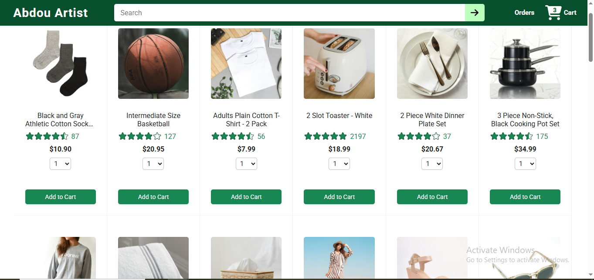
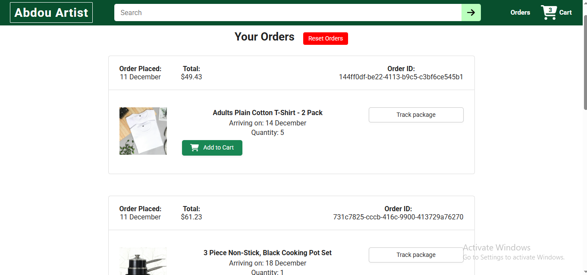
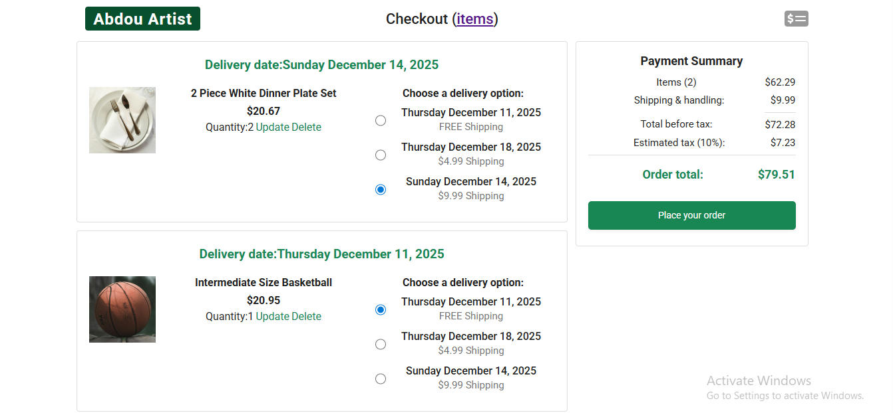
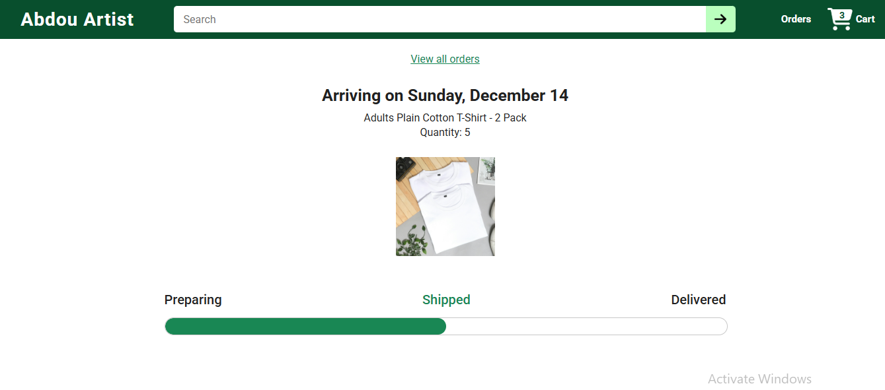

# 🛒 Amazon Clone — React + Vite + Node Backend API

This project was originally built from static HTML pages. I rebuilt everything using React (Vite) for the frontend and Node.js for the backend. The application includes routing, dynamic rendering, backend data, and product tracking.

## 🚀 Features

### Frontend (React + Vite)
- Converted all pages from static HTML into JSX components
- Component-based architecture
- React Router navigation (Home, Checkout, Orders, Tracking)
- URL query parameters to track products
- Axios for backend requests
- day.js for formatting dates
- Global state lifted into App.jsx
- Dynamic product rendering
- Conditional rendering to prevent UI errors

### Backend (Node API)
The backend provides product and order data used by the frontend.

API Endpoints:
GET /api/orders?expand=products
GET /api/cart-items?expand=products

The backend returns:
- Product names
- Product images
- Prices
- Quantities
- Delivery dates
- Nested product objects

The frontend depends on the backend to load data.

## 📸 Screenshots

Home Page

Orders Page

Checkout Page

Tracking Page

## 🧠 What I Learned

### React
- JSX conversion
- Component structure
- React Router
- State lifting
- Rendering nested JSON
- Conditional UI rendering
- Formatting timestamps with day.js

### Backend Integration
- Running backend and frontend together
- Debugging Axios requests
- Using URL query parameters
- Rendering backend data dynamically

### AI Assistance
- Debugging routing
- Fixing backend to frontend issues
- Improving architecture
- Learning best React patterns

## 📦 Technologies Used

Frontend:
React (Vite), React Router, Axios, day.js, JavaScript (ES6), CSS

Backend:
Node.js, Express-style routing, JSON mock data

# 🛠 How to Run Locally

## Start the Frontend
cd frontend
npm install
npm run dev

Runs at:
http://localhost:5173/

## Start the Backend
cd backend
npm install
npm run dev

Or:
node server.js

Runs at:
http://localhost:3000/

API Endpoints:
http://localhost:3000/api/orders?expand=products
http://localhost:3000/api/cart-items?expand=products

The frontend will not load real data unless the backend is running.

## 📌 Project Status
In progress.
Planned improvements:
- Full REST API
- Deploy backend
- Deploy frontend
- Connect deployed backend to frontend

## 👤 Author
Ali Alpha (@lopikola11-cmyk)
React Developer • Building Real Projects
