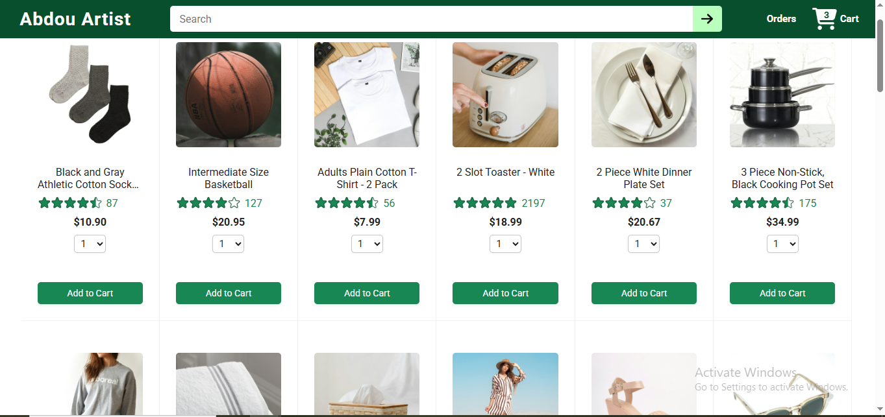
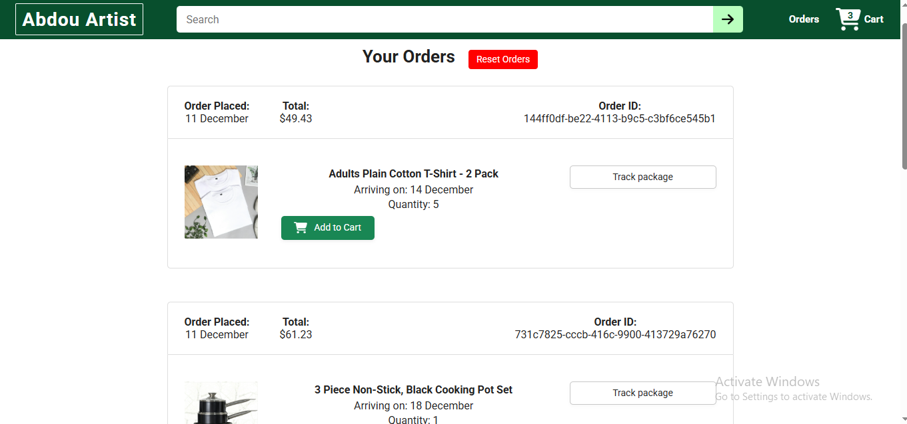
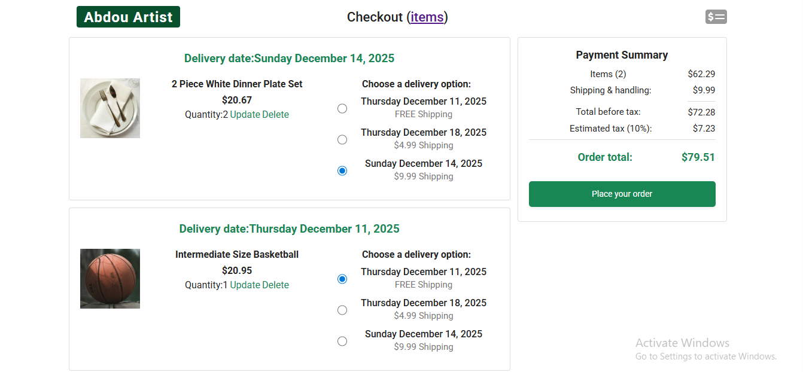
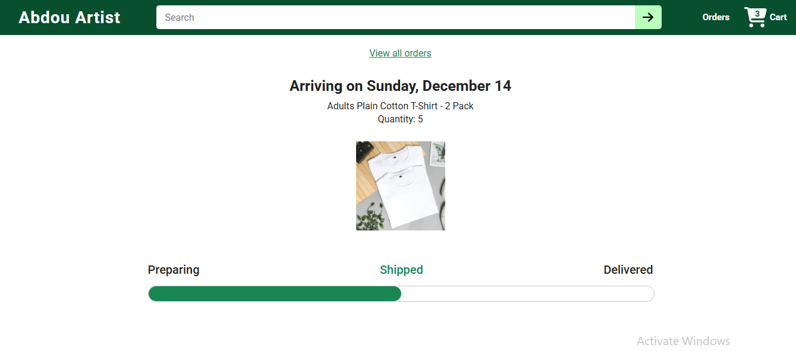

# 🛒 Amazon Clone — React + Vite + Node Backend API

This project was originally built from static HTML pages. I rebuilt everything using React (Vite) for the frontend.  
The backend API was provided, but I learned how to run it locally, integrate it fully with my frontend, and deploy it in production using Render.

The result is a complete full-stack Amazon-style shopping experience with cart management, orders, and tracking.

---

# 🌐 Live Demo

Frontend (Vercel):  
https://amazon-clone-react-vite.vercel.app/

Backend API (Render):  
https://amazon-backend-dkf4.onrender.com/api/products

---

# 🚀 Features

Frontend (React + Vite):
- Converted static HTML into reusable React components
- React Router navigation (Home, Checkout, Orders, Tracking)
- Dynamic tracking routes: /tracking/:orderId/:productId
- Axios for backend API requests
- Full cart functionality: add, update, delete, choose delivery
- Auto-updating payment summary
- day.js for delivery date formatting
- Smooth re-renders without page refresh

Orders System:
- Creating orders using POST /api/orders
- Backend automatically empties the cart
- Orders page shows products, quantities, delivery dates, totals
- “Buy Again” function re-adds products to cart

Tracking System:
- URL params determine product + order tracking data
- Displays tracking status, product image, quantity, etc.

---

# 🧠 What I Learned

React:
- JSX components
- Props and state lifting
- React Router with dynamic routes
- Conditional rendering
- Async data fetching with Axios
- Debugging and error handling
- DOM diffing and re-render behavior

Backend Integration:
- Performing CRUD operations with Axios
- Understanding REST API structure
- Keeping UI synchronized with backend state
- Structuring async request flows
- Reading nested API data

Deployment Skills:
- Deploying frontend on Vercel
- Deploying backend API on Render
- Connecting frontend ↔ backend using API URLs
- Fixing deployment errors (CORS, 404s, routing)
- Debugging Render logs and Vercel builds
- Fixing Git merge conflicts

Important Note:  
I did not create the backend myself, but I learned how to run it in VS Code, integrate it completely into my frontend, and deploy it successfully.

---

# 📸 Screenshots

Home Page  

Orders Page  

Checkout Page  

Tracking Page  

---

# 🛠 How to Run Locally

Start the Frontend:
cd frontend  
npm install  
npm run dev  
Runs at: http://localhost:5173/

Start the Backend:
cd backend  
npm install  
npm run dev  
Runs at: http://localhost:3000/

Useful API Endpoints:
http://localhost:3000/api/products  
http://localhost:3000/api/orders?expand=products  
http://localhost:3000/api/cart-items?expand=product  

Frontend must be connected to backend for data to appear.

---

# 📌 Project Status
Complete and fully functional.

Future Improvements:
- Authentication (JWT / OAuth)
- Real database (PostgreSQL / MongoDB)
- Better UI/UX design
- Product search & filtering
- Checkout with Stripe
- Pagination & sorting

---

# 👤 Author
Zerouali Abderrahmane (@lopikola11-cmyk)  
Frontend React Developer • Building Real Projects
